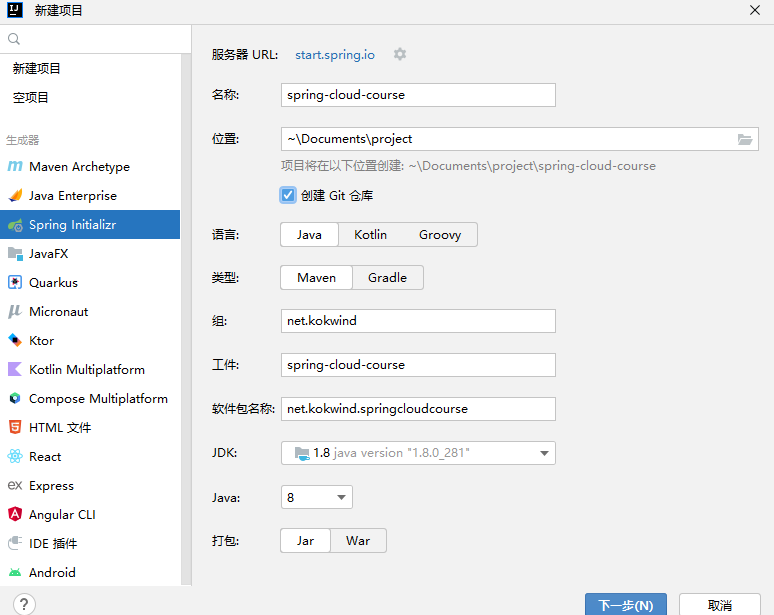
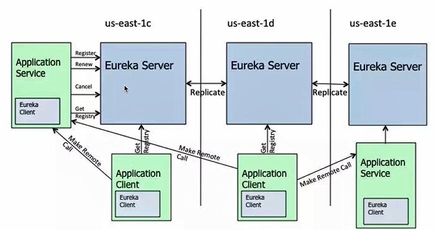

# 微服务和Spring Cloud

## 1 微服务基础

### 1.1 什么是微服务

#### 1.1.1 单体应用的痛点

- 部署效率低下（pom文件太长，依赖多）
- 团队协作开发成本高
- 系统可用性差

#### 1.1.2 服务化

- 把传统的单机应⽤中通过JAR包依赖产⽣的本地⽅法调⽤，改造成通过RPC、HTTP产⽣的远程⽅法调⽤

- 把⽤户模块从单体应⽤中拆分出来，独⽴成⼀个服务部署

- ⽤户模块就可以独⽴开发、测试、上线和运维，可以交由专⻔的团队来做，与主模块不耦合

  

  

#### 1.1.3 什么是微服务

- 一种架构风格
- 开发单个应用作为一系列小型服务的套件，其中每个服务都运行在自己的进程中，并且通过轻量级的机制实现彼此间的通信，这通常是HTTP资源API。
- 这些服务是围绕着业务功能构建的，并且可以通过完全自动化的部署机制进行独立部署。
- 这些服务的集中式管理做到了最小化（例如docker相关技术），每一种服务都可以通过不同的编程语言进行编写，并且可以使用不同的数据存储技术。

### 1.2 微服务的特点

- 组件以服务形式来提供

- 产品不是项目

- 轻量级通信、独立进程

- 分散治理、去中心化治理

- 容错性设计

- 会带来团队组织架构的调整

  


### 1.3 微服务优缺点

优点：

- 服务简单、便于学习和上手，相对易于维护

- 独立部署。灵活扩展

- 技术栈丰富

  

缺点：

- 运维成本过高
- 接口可能不匹配
- 代码可能重复
- 架构复杂度提高


### 1.4 微服务两大门派

- Spring Cloud：众多子项目

- Dubbo：高性能、轻量级的开源 Java RPC 框架，它提供了三大核心能力：面向接口的远程方法调用，智能容错和负载均衡，以及服务自动注册和发现Dubbo 提供的能力只是 Spring Cloud 的一部分子集

- Dubbo 提供的能力只是 Spring Cloud 的一部分子集

  

RPC VS REST

- 服务提供方与调用方接口依赖方式太强
- 服务对平台敏感，难以简单复用


### 1.5 微服务拆分

#### 1.5.1 什么时候进行服务化拆分

- 第一阶段的主要目标是快速开发和验证想法
- 进一步增加更多的新特性来吸引更多的目标用户
- 同时进行开发的人员超过10人，这个时候就该考虑进行服务化拆分

#### 1.5.2 不适合拆分的情况

- 小团队，技术进出较薄弱
- 流量不高，压力小，业务变化也不大
- 对延迟很敏感的低延迟高并发系统

#### 1.5.3 微服务拆分的两种姿势

- 纵向拆分
- 横向拆分
- 结合业务综合分析


### 1.6 微服务扩展

- x轴 - 水平复制
- y轴 - 功能解耦
- z轴 - 数据分区


自动按需扩展

- 根据CPU负载程度、特定时间（比如周末）、消息中间件的队列长度、业务具体规则、预测等来决定是否扩展

- 自动分配一个新的服务实例，提高可用性

- 提高了可伸缩性（双11之后，自动减少服务器）

- 具有最佳使用率，节约成本

  

### 1.7 微服务重要模块

- 服务描述
- 注册中心
- 服务框架
- 负载均衡
- 熔断和降级
- 网关


## 2 Spring Cloud

### 2.1 Spring Cloud简介

- 成熟的微服务框架，定位为开发人员提供工具，以快速构建分布式系统

  


### 2.2 项目整体设计

- 项目介绍
- 接口设计
  - 课程列表
  - 单个课程价格
  - 整合课程列表和价格


- 表设计

  **course**表(id，课程id，课程名，上下架)

  

  

  **SQL**

  ```sql
  SET NAMES utf8mb4;
  SET FOREIGN_KEY_CHECKS = 0;
  
  -- ----------------------------
  -- Table structure for course
  -- ----------------------------
  DROP TABLE IF EXISTS `course`;
  CREATE TABLE `course`  (
    `id` int(11) NOT NULL AUTO_INCREMENT,
    `course_id` int(11) NULL DEFAULT NULL,
    `name` varchar(50) CHARACTER SET utf8mb4 COLLATE utf8mb4_general_ci NULL DEFAULT NULL,
    `valid` int(1) NULL DEFAULT NULL,
    PRIMARY KEY (`id`) USING BTREE
  ) ENGINE = InnoDB AUTO_INCREMENT = 1 CHARACTER SET = utf8mb4 COLLATE = utf8mb4_general_ci ROW_FORMAT = Dynamic;
  
  SET FOREIGN_KEY_CHECKS = 1;
  ```

  

  **course_price**表(id，课程id，价格)

  

  **SQL**

  ```sql
  SET NAMES utf8mb4;
  SET FOREIGN_KEY_CHECKS = 0;
  
  -- ----------------------------
  -- Table structure for course_price
  -- ----------------------------
  DROP TABLE IF EXISTS `course_price`;
  CREATE TABLE `course_price`  (
    `id` int(11) NOT NULL AUTO_INCREMENT,
    `course_id` int(11) NULL DEFAULT NULL,
    `price` int(11) NULL DEFAULT NULL,
    PRIMARY KEY (`id`) USING BTREE
  ) ENGINE = InnoDB AUTO_INCREMENT = 1 CHARACTER SET = utf8mb4 COLLATE = utf8mb4_general_ci ROW_FORMAT = Dynamic;
  
  SET FOREIGN_KEY_CHECKS = 1;
  ```

  

### 2.3 课程列表模块开发





创建好后同样方法删除`src`，新建模块`course-list`和`course-price`，父项`course-service`


### 2.4 课程价格模块开发

#### 2.4.1 配置`course-list`下的`pom.xml`文件

```xml
<?xml version="1.0" encoding="UTF-8"?>
<project xmlns="http://maven.apache.org/POM/4.0.0"
         xmlns:xsi="http://www.w3.org/2001/XMLSchema-instance"
         xsi:schemaLocation="http://maven.apache.org/POM/4.0.0 http://maven.apache.org/xsd/maven-4.0.0.xsd">
    <parent>
        <artifactId>course-service</artifactId>
        <groupId>net.kokwind</groupId>
        <version>0.0.1-SNAPSHOT</version>
    </parent>
    <modelVersion>4.0.0</modelVersion>

    <artifactId>course-list</artifactId>

    <properties>
        <maven.compiler.source>8</maven.compiler.source>
        <maven.compiler.target>8</maven.compiler.target>
    </properties>

    <dependencies>
        <dependency>
            <groupId>org.springframework.boot</groupId>
            <artifactId>spring-boot-starter-web</artifactId>
            <version>2.6.4</version>
        </dependency>
        <dependency>
            <groupId>org.springframework.boot</groupId>
            <artifactId>spring-boot-starter-test</artifactId>
            <version>2.6.4</version>
        </dependency>
        <dependency>
            <groupId>mysql</groupId>
            <artifactId>mysql-connector-java</artifactId>
            <version>8.0.28</version>
        </dependency>
        <dependency>
            <groupId>org.mybatis.spring.boot</groupId>
            <artifactId>mybatis-spring-boot-starter</artifactId>
            <version>2.2.2</version>
        </dependency>
    </dependencies>

    <build>
        <plugins>
            <plugin>
                <groupId>org.springframework.boot</groupId>
                <artifactId>spring-boot-maven-plugin</artifactId>
            </plugin>
        </plugins>
    </build>

</project>
```


#### 2.4.2 新建启动类

新建`net.kokwind.course`软件包

```java
package net.kokwind.course;

import org.springframework.boot.SpringApplication;
import org.springframework.boot.autoconfigure.SpringBootApplication;

/**
 * 描述： 项目启动类
 */
@SpringBootApplication
public class CourseListApplication {
    public static void main(String[] args) {
        SpringApplication.run(CourseListApplication.class, args);
    }
}
```

在`resources`下新建配置文件`application.properties`

```xml
server.port=8081
#mysql
spring.datasource.driver-class-name=com.mysql.cj.jdbc.Driver
spring.datasource.username=root
spring.datasource.password=ibm99ibm
spring.datasource.url=jdbc:mysql://139.186.157.42:28001/springboot?useUnicode=true&characterEncoding=UTF-8
#日志
logging.pattern.console=%clr(%d{${LOG_DATEFORMAT_PATTERN:HH:mm:ss.SSS}}){faint} %clr(${LOG_LEVEL_PATTERN:-%5p}) %clr(${PID:- }){magenta} %clr(---){faint} %clr([%15.15t]){faint} %clr(%-40.40logger{39}){cyan} %clr(:){faint} %m%n${LOG_EXCEPTION_CONVERSION_WORD:%wEx}
#配置mybatis驼峰式命名转换
mybatis.configuration.map-underscore-to-camel-case=true
spring.application.name=course-list
```

#### 2.4.3 新建对应course表的实体类

`implements Serializable`是一个对象序列化的接口，一个类只有实现了Serializable接口，它的对象才是可序列化的。加上 `@RestController` 后，会直接返回 json 数据，JSON是序列化

```java
package net.kokwind.course.entity;

import java.io.Serializable;

/**
 * 描述： Course实体类
 */
public class Course implements Serializable {
    private Integer id;
    private Integer courseId;
    private String name;
    private Integer valid;

    public Integer getId() {
        return id;
    }

    public void setId(Integer id) {
        this.id = id;
    }

    public Integer getCourseId() {
        return courseId;
    }

    public void setCourseId(Integer courseId) {
        this.courseId = courseId;
    }

    public String getName() {
        return name;
    }

    public void setName(String name) {
        this.name = name;
    }

    public Integer getValid() {
        return valid;
    }

    public void setValid(Integer valid) {
        this.valid = valid;
    }

    @Override
    public String toString() {
        return "Course{" +
                "id=" + id +
                ", courseId=" + courseId +
                ", name='" + name + '\'' +
                ", valid=" + valid +
                '}';
    }
}
```

#### 2.4.4 新建对应的DAO

然后创建一个`CourseMapper`接口，上面需要写上

@Mapper注释用来表示该接口类的实现类对象交给mybatis底层创建，然后交由Spring框架管理

@Repository注解修饰哪个类，则表明这个类具有对对象进行CRUD（增删改查）的功能

我们不用自己创建该接口的实现类对象而是在这个接口上采用了@Mapper注解让Mybatis底层为我们创建这个接口的实现类对象所以我们可以直接调用它的方法。

```java
package net.kokwind.course.dao;

import net.kokwind.course.entity.Course;
import org.apache.ibatis.annotations.Mapper;
import org.apache.ibatis.annotations.Select;
import org.springframework.stereotype.Repository;

import java.util.List;

/**
 * 描述: 课程的Mapper类
 */
@Mapper
@Repository
public interface CourseMapper {
    @Select("select * from course where valid = 1")
    List<Course> listCourse();
}
```

#### 2.4.5 新颖对应DAO的service业务逻辑

创建一个`CourseListService`类

`@Service`注解用于类上，标记当前类是一个`service`类，加上该注解会将当前类自动注入到spring容器中，不需要再在`applicationContext.xml`文件定义bean了。 在调用该`service`的时候只需要将该类注入接口中即可： 用`@Autowired`注解表示将这个接口类的实现类对象赋值给接口属性

```java
package net.kokwind.course.service;
/**
 * 描述： 课程列表服务
 */

import net.kokwind.course.dao.CourseMapper;
import net.kokwind.course.entity.Course;
import org.springframework.beans.factory.annotation.Autowired;
import org.springframework.stereotype.Service;

import java.util.List;
@Service
public class CourseListService {
    @Autowired
    private CourseMapper courseMapper;

    public List<Course> getCourseList(){
        return courseMapper.listCourse();
    }
}
```


#### 2.4.6 新建对应业务的controller

```java
package net.kokwind.course.controller;

import net.kokwind.course.entity.Course;
import net.kokwind.course.service.CourseListService;
import org.springframework.beans.factory.annotation.Autowired;
import org.springframework.web.bind.annotation.GetMapping;
import org.springframework.web.bind.annotation.RestController;

import java.util.List;

@RestController
public class CourseController {
    @Autowired
    private CourseListService courseListService;

    @GetMapping("/courses")
    public List<Course> courseList() {
        return courseListService.getCourseList();
    }
}
```


#### 2.4.7 插入表数据


#### 2.4.8 启动


#### 2.4.9 同样方法完成`CoursePrice`

表中插入数据


启动测试


### 2.5 服务注册与发现Eureka

#### 2.5.1 Eureka架构

- Eureka Server和Eureka Client

  
  
- 集群
  
  
  

#### 2.5.2 引入Eureka

- 引入依赖
- 配置文件
- 启动zhu'jie

##### 2.5.2.1 新建Eureka


##### 2.5.2.2 引入Eureka依赖

```XML
<?xml version="1.0" encoding="UTF-8"?>
<project xmlns="http://maven.apache.org/POM/4.0.0"
         xmlns:xsi="http://www.w3.org/2001/XMLSchema-instance"
         xsi:schemaLocation="http://maven.apache.org/POM/4.0.0 http://maven.apache.org/xsd/maven-4.0.0.xsd">
    <parent>
        <artifactId>spring-cloud-course</artifactId>
        <groupId>net.kokwind</groupId>
        <version>0.0.1-SNAPSHOT</version>
    </parent>
    <modelVersion>4.0.0</modelVersion>

    <artifactId>eureka-service</artifactId>

    <properties>
        <maven.compiler.source>8</maven.compiler.source>
        <maven.compiler.target>8</maven.compiler.target>
    </properties>

    <dependencies>
        <dependency>
            <groupId>org.mybatis.spring.boot</groupId>
            <artifactId>mybatis-spring-boot-starter</artifactId>
            <version>2.2.2</version>
        </dependency>
        <dependency>
            <groupId>org.springframework.cloud</groupId>
            <artifactId>spring-cloud-starter-netflix-eureka-server</artifactId>
        </dependency>
    </dependencies>

    <build>
        <plugins>
            <plugin>
                <groupId>org.springframework.boot</groupId>
                <artifactId>spring-boot-maven-plugin</artifactId>
            </plugin>
        </plugins>
    </build>

</project>
```

同时修改`spring-cloud-course`下的`pom.xml`文件

```xml
<?xml version="1.0" encoding="UTF-8"?>
<project xmlns="http://maven.apache.org/POM/4.0.0" xmlns:xsi="http://www.w3.org/2001/XMLSchema-instance"
         xsi:schemaLocation="http://maven.apache.org/POM/4.0.0 https://maven.apache.org/xsd/maven-4.0.0.xsd">
    <modelVersion>4.0.0</modelVersion>
    <packaging>pom</packaging>
    <modules>
        <module>course-service</module>
        <module>eureka-service</module>
    </modules>
    <parent>
        <groupId>org.springframework.boot</groupId>
        <artifactId>spring-boot-starter-parent</artifactId>
        <version>2.1.12.RELEASE</version>
        <relativePath/> <!-- lookup parent from repository -->
    </parent>
    <groupId>net.kokwind</groupId>
    <artifactId>spring-cloud-course</artifactId>
    <version>0.0.1-SNAPSHOT</version>
    <name>spring-cloud-course</name>
    <description>spring-cloud-course</description>
    <properties>
        <java.version>1.8</java.version>
    </properties>
    <dependencies>
        <dependency>
            <groupId>org.springframework.boot</groupId>
            <artifactId>spring-boot-starter</artifactId>
        </dependency>

        <dependency>
            <groupId>org.springframework.boot</groupId>
            <artifactId>spring-boot-starter-test</artifactId>
            <scope>test</scope>
        </dependency>

        <dependency>
            <groupId>org.springframework.boot</groupId>
            <artifactId>spring-boot-starter-web</artifactId>
        </dependency>

        <dependency>
            <groupId>org.springframework.cloud</groupId>
            <artifactId>spring-cloud-commons</artifactId>
        </dependency>
    </dependencies>

    <!-- 标识Spring Cloud的版本 -->
    <dependencyManagement>
        <dependencies>
            <dependency>
                <groupId>org.springframework.cloud</groupId>
                <artifactId>spring-cloud-dependencies</artifactId>
                <version>Greenwich.SR5</version>
                <type>pom</type>
                <scope>import</scope>
            </dependency>
        </dependencies>
    </dependencyManagement>


    <build>
        <plugins>
            <plugin>
                <groupId>org.springframework.boot</groupId>
                <artifactId>spring-boot-maven-plugin</artifactId>
            </plugin>
        </plugins>
    </build>

</project>

```


##### 2.5.2.3 配置`application.properties`

```xml
spring.application.name=eureka-server
server.port=8000
eureka.instance.hostname=localhost
#fetch-registry获取注册表。不需要同步其它节点数据
eureka.client.fetch-registry=false
#register-with-eureka代表是否将自己注册到Eureka Server默认是true
eureka.client.register-with-eureka=false
eureka.client.service-url.defaultZone=http://${eureka.instance.hostname}:${server.port}/eureka/
```


##### 2.5.2.4 新建启动类注解`@EnableEurekaServer`

```java
package net.kokwind.course;
/**
 * 描述： Eureka服务端
 */

import org.springframework.boot.SpringApplication;
import org.springframework.boot.autoconfigure.SpringBootApplication;
import org.springframework.cloud.netflix.eureka.server.EnableEurekaServer;

@SpringBootApplication
@EnableEurekaServer
public class EurekaServerApplication {
    public static void main(String[] args) {
        SpringApplication.run(EurekaServerApplication.class, args);
    }
}
```

##### 2.5.2.5 启动服务端


##### 2.5.2.6 把`course-list`和`price`注册成客户端

首先添加依赖

```xml
        <dependency>
            <groupId>org.springframework.cloud</groupId>
            <artifactId>spring-cloud-starter-netflix-eureka-client</artifactId>
        </dependency>
```

接着添加属性

```
eureka.client.service-url.defaultZone=http://localhost:8000/eureka/
```

重新启动就可以了


### 2.6 服务间调用Feign


服务间调用Feign可以让`course-price`调用`course-list`的`http`的远程请求像本地方法调用一样简单。基于接口和注解来实现的。不利用feign需要手写http请求，包括传入参数，请求头，cookie等。

#### 2.6.1 集成Feign

 ##### 2.6.1.1 引入依赖

```xml
        <dependency>
            <groupId>org.springframework.cloud</groupId>
            <artifactId>spring-cloud-starter-openfeign</artifactId>
        </dependency>
```


##### 2.6.1.2 新建客户端类

新建包`net.kokwind.course.clien`

新建`CourseListClient`接口作客户端

```java
package net.kokwind.course.client;

import net.kokwind.course.entity.Course;
import org.springframework.cloud.openfeign.FeignClient;
import org.springframework.web.bind.annotation.GetMapping;

import java.util.List;

/**
 * 描述： 课程列表的Feign客户端
 */
@FeignClient(value = "course-list")
public interface CourseListClient {
    @GetMapping("/courses")
    public List<Course> courseList();
}
```


引入后会在`pom.xml`下增加依赖。

```xml
        <dependency>
            <groupId>net.kokwind</groupId>
            <artifactId>course-list</artifactId>
            <version>0.0.1-SNAPSHOT</version>
            <scope>compile</scope>
        </dependency>
```

##### 2.6.1.3 修改controller增加调用方法
**getCourseListInPrice**
添加feign客户端后调用就和本地调用非常相似。
```
    @Autowired
    private CourseListClient courseListClient;
```
```java
package net.kokwind.course.controller;
/**
 * 描述： 课程价格控制器
 */

import net.kokwind.course.client.CourseListClient;
import net.kokwind.course.entity.Course;
import net.kokwind.course.entity.CoursePrice;
import net.kokwind.course.service.CoursePriceService;
import org.springframework.beans.factory.annotation.Autowired;
import org.springframework.web.bind.annotation.GetMapping;
import org.springframework.web.bind.annotation.RestController;

import java.util.List;

@RestController
public class CoursePriceController {
    @Autowired
    private CoursePriceService coursePriceService;
    @Autowired
    private CourseListClient courseListClient;

    @GetMapping("/price")
    public Integer getCoursePrice(Integer courseId) {
        CoursePrice coursePrice = coursePriceService.getCoursePrice(courseId);
        return coursePrice.getPrice();
    }

    @GetMapping("/coursesInPrice")
    public List<Course> getCourseListInPrice() {
        List<Course> courses = courseListClient.courseList();
        return courses;
    }
}
```
启动后可以看到，成功完成了服务间的调用


### 2.7 负载均衡Ribbon

- 客户端负载均衡(Ribbon)
- 服务端负载均衡(Nginx)

#### 2.7.1 负载均衡策略

- RandomRule随机策略
- RoundRobinRule轮询策略
- ResponseTimeWeightedRule加权，根据每一个Server的平均响应时间动态加权

#### 2.7.2 配置不同的负载均衡方式

- Ribbon.NFLoadBalancerRuleClassName

比如对`course-price`进行负载均衡的配置

在`application.properties`里添加

```
course-list.ribbon.NFLoadBalancerRuleClassName=com.netflix.loadbalancer.RoundRobinRule
```


### 2.8 熔断器Hysrix

#### 2.8.1 为什么需要断路器


比如访问量太大时突然某个服务不可用了，不会让其它服务等待或卡死，而是返回告知信息。

#### 2.8.2 给course-price配置断路器

##### 2.8.2.1 加依赖

```xml
        <dependency>
            <groupId>org.springframework.cloud</groupId>
            <artifactId>spring-cloud-starter-netflix-hystrix</artifactId>
        </dependency>
```

##### 2.8.2.2 加配置

```
feign.hystrix.enabled=true
```

##### 2.8.2.3 启动类加注解

`@EnableCircuitBreaker`

```JAVA
package net.kokwind.course;

import org.springframework.boot.SpringApplication;
import org.springframework.boot.autoconfigure.SpringBootApplication;
import org.springframework.cloud.client.circuitbreaker.EnableCircuitBreaker;
import org.springframework.cloud.openfeign.EnableFeignClients;

/**
 * 描述： 项目启动类
 */
@SpringBootApplication
@EnableCircuitBreaker
@EnableFeignClients
public class CoursePriceApplication {
    public static void main(String[] args) {
        SpringApplication.run(CoursePriceApplication.class, args);
    }
}
```

##### 2.8.2.4 当远程courseList()不能访问时

添加兜底方法`courseList()`

新建类`CourseListClientHystrix`

```java
package net.kokwind.course.client;

import net.kokwind.course.entity.Course;
import org.springframework.stereotype.Component;

import java.util.ArrayList;
import java.util.List;

/**
 * 描述： 断路器实现类
 */
@Component
public class CourseListClientHystrix implements CourseListClient {
    @Override
    public List<Course> courseList() {
        //默认情况下调用远端方法，当远端方法不可用时调用本地方法
        List<Course> defaultCourses = new ArrayList<>();
        Course course = new Course();
        course.setId(1);
        course.setCourseId(1);
        course.setName("默认课程");
        course.setValid(1);
        defaultCourses.add(course);
        return defaultCourses;
    }
}   // CourseListClientHystrix
```

在feign客户端里指明服务不可用时使用类`CourseListClientHystrix`

```java
package net.kokwind.course.client;

import net.kokwind.course.entity.Course;
import org.springframework.cloud.openfeign.FeignClient;
import org.springframework.context.annotation.Primary;
import org.springframework.web.bind.annotation.GetMapping;

import java.util.List;

/**
 * 描述： 课程列表的Feign客户端
 */
@FeignClient(value = "course-list",fallback = CourseListClientHystrix.class)
//因为有两个courseList，所以加了@Primary
@Primary
public interface CourseListClient {
    @GetMapping("/courses")
    public List<Course> courseList();
}
```

##### 2.8.2.5 启动测试

服务可用时


服务不可用时


### 2.9 网关Zuul


### 2.10 整体测试


